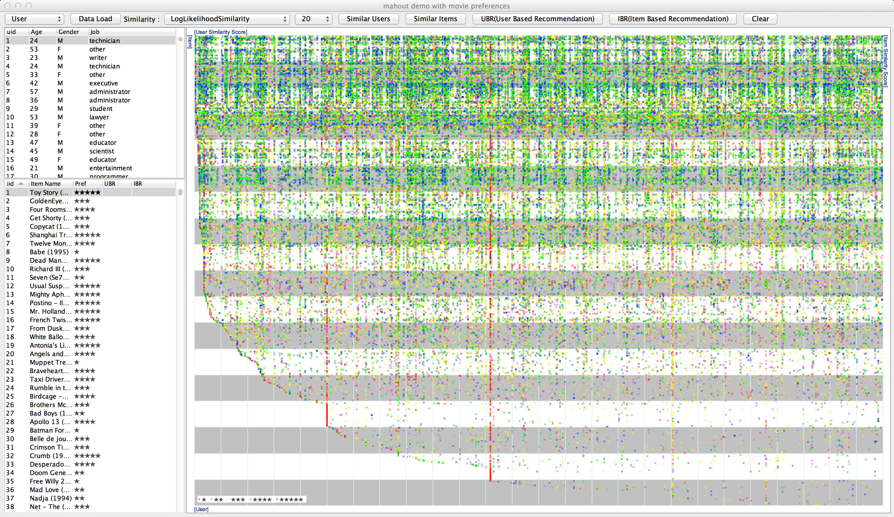
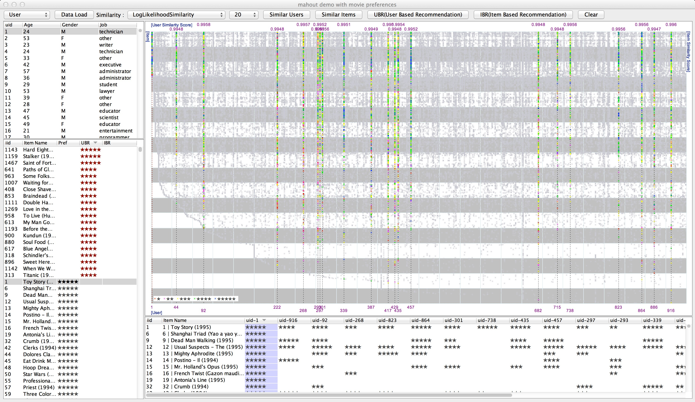
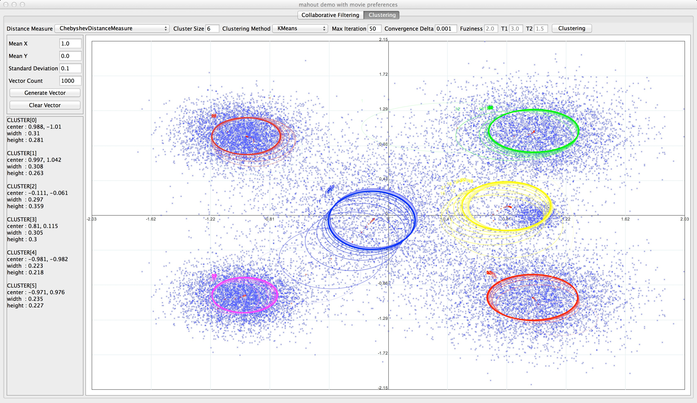
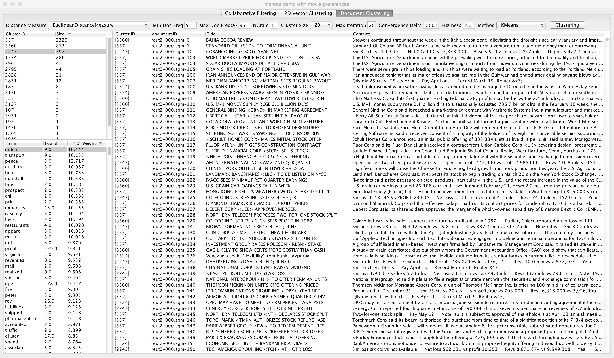

Mahout Evaluator
==========

Welcom to mahout evaluator.

This project is developed to show how mahout works and evaluate mahout algorithm.
By default, it uses GroupLens user, movie and preference data(http://grouplens.org/datasets/movielens/).

Any other user, item and preference data can be loaded as long as each file follows CSV format.
The first line of data file is column header which can be displayed as a header in user, item table.

Features
==========

(Collaborative Filtering)

-. User Based Recommendation

-. Item Based Recommendation

-. Similar Users

-. Similar Items

(Clustering)

-. KMeans Clustering

-. Fuzzy KMeans Clustering

-. Canopy Clustering

Build with maven
==========
mvn clean install

Execution
==========
java -jar mahout-eval-0.0.1-SNAPSHOT-jar-with-dependencies.jar
